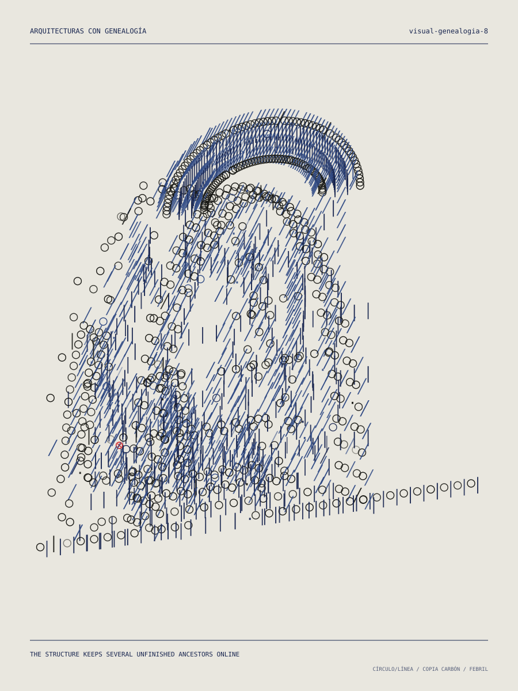

# LA LETRA SOSTIENE EL TECHO

**Arquitecturas experimentales de signos / instrumento generativo 07 de poesiasexp**

La computadora recibe una semilla y decide todo: especie, frase, masa, vacío,
perspectiva, temperatura, error, relación entre cuerpos, morfologías, cruces,
curvatura, portales, genealogía, alfabeto, color y copia carbón. El visitante no diseña la obra. Puede solicitar otra
aparición o intervenir la que recibió.



## Abrir

No hay build ni dependencias:

```bash
python3 -m http.server 8080
```

Después visita:

```text
http://localhost:8080/arquitecturasunicode/
```

La URL sólo guarda la semilla. La misma URL reconstruye exactamente la misma
arquitectura, incluida la frase, la perspectiva y las decisiones cromáticas.

## Especies

### ARQUITECTURAS CON GENEALOGÍA

La especie dominante ya no selecciona una silueta cerrada. Cada semilla combina
seis genes arquitectónicos independientes:

- **PLANTA** — barra, L, U, patio, anillo, torres o basamento escalonado;
- **ESTRUCTURA** — losas, pórticos, costillas, bóvedas, pantallas, columnas o cintas;
- **VACÍO** — arco, túnel, patio, grieta, portal o núcleo ausente;
- **CUBIERTA** — voladizo, cúpula, bloque desplazado, terrazas, aletas o corona;
- **ANEXO** — puente incompleto, torre parásita, escalera, balcón, segundo cuerpo o ninguno;
- **DEFORMACIÓN** — inclinar, curvar, torcer, repetir, erosionar o entrelazar.

Son 63,504 genealogías antes de variar cantidades, proporciones, perspectiva,
frase, signos y color. Distintos cuerpos de una misma aparición pueden heredar
estructuras secundarias. Aproximadamente una de cada ocho genealogías recibe
además una contaminación topológica: horizonte curvo, gravedad parcial o
interior expandido.

### ARCO PARA UNA PALABRA AUSENTE

Masa voxelar, vano auténticamente excavado, anexos, crujías posteriores,
voladizos, ventanas y erosión. El arco ya no es la pieza completa: es una
especie minoritaria que reaparece como memoria constructiva del primer motor.

### DOS EDIFICIOS ESPERÁNDOSE

Dos cuerpos paramétricos se construyen a los lados de una distancia real.
Cada uno elige una morfología:

- **ESTRATOS** — losas apiladas que se desplazan y ensanchan;
- **COSTILLAS** — membranas curvas y pisos transversales;
- **PANTALLA** — muro ondulante, algunas veces perforado;
- **ANILLO** — cuerpo circular incompleto orientado hacia el otro;
- **PLIEGUE** — pantalla vertical en acordeón;
- **TÓTEM** — módulos y placas apiladas.

La relación puede ser `ESPEJO IMPERFECTO`, `PARIENTES`, `DESCONOCIDOS` o
`UNO RECUERDA MAL AL OTRO`. Algunas semillas producen balcones o puentes que
se detienen antes de tocarse. El vacío nunca es una superficie transparente:
simplemente no existe geometría allí.

### ARQUITECTURAS ENTRELAZADAS

Cuerpos paramétricos atraviesan sus propios interiores o el interior de otros
cuerpos. El motor elige entre cinco parentescos:

- **DOBLE HÉLICE** — dos cintas habitables ascienden alternando delante y detrás;
- **LAZO HABITABLE** — una figura de ocho contiene otra habitación circular;
- **CÁPSULAS ENLAZADAS** — dos o tres anillos estructurales comparten cruces;
- **ESPIRAL ATRAVESADA** — un corredor recto perfora una envolvente recurrente;
- **NUDO DE LOSAS** — una cinta toroidal y su núcleo organizan varios interiores.

Los cruces no usan opacidad para fingir profundidad. En cada encuentro el
cuerpo posterior deja de emitir signos durante un pequeño tramo: la ausencia
es el mecanismo de oclusión. Cada sistema toca el suelo mediante apoyos y un
zócalo discontinuo, para conservar escala arquitectónica aun en sus estados
más febriles.

### GEOMETRÍAS QUE REGRESAN

La cuarta especie no dibuja solamente formas curvas: cambia las leyes que
organizan el espacio. La semilla elige curvatura positiva, negativa o casi
plana, entre uno y tres centros de gravedad, portales y fallos de orientación.

- **ESFERA HABITABLE** — una habitación ocupa la cara interior de una envolvente perforada;
- **INTERIOR MAYOR QUE EL EXTERIOR** — una puerta pequeña se expande en salas hiperbólicas;
- **PASILLO RECURRENTE** — una cinta cerrada regresa orientada o con media vuelta de Möbius;
- **CÚPULA INVERSA** — el techo cae hacia un pozo central mientras sus bordes permanecen arriba;
- **PATIO DE HORIZONTE CURVO** — edificios radiales comparten uno o varios centros de gravedad.

Los portales son huecos sin caracteres, no círculos pintados encima. Palabras
como `regresa`, `horizonte`, `interior`, `arriba` o `cúpula` cargan la semilla
con retorno, inversión y curvatura adicional.

## Azar firmado

La gramática arquitectónica ocupa aproximadamente 55% de las semillas. El arco,
la espera y el entrelazado permanecen como memorias y mutaciones; la especie no
euclidiana completa aparece sólo alrededor de 8% de las veces.

La distribución favorece la perspectiva oblicua. Aproximadamente 4.5%
de las semillas producen una vista casi frontal; es rara, pero posible. La
temperatura puede ser `SERENA`, `INESTABLE` o `FEBRIL`. Cuanto más febril, más
desplazamiento, voladizo, erosión, recursión y errores de mecanografiado.

Hay doce alfabetos restringidos y ocho familias cromáticas, desde papel de
archivo y copia carbón hasta plano azul, cartulina ácida y noche de terminal.
Cada lámina usa como máximo cuatro signos dominantes.

## Intervenir

- **OTRA ARQUITECTURA**: nueva semilla;
- **clic** en un signo: retipar dentro del alfabeto de la obra;
- **EXCAVAR** + arrastrar: retirar signos/vóxeles;
- **COPIA CARBÓN**: segunda impresión desregistrada;
- `N`: otra arquitectura;
- `E`: alternar retipar/excavar;
- `C`: copia carbón;
- `S`: exportar SVG;
- `J`: exportar JSON.

El SVG conserva caracteres editables e incrusta Apercu, Apricot Portable y
Symbola cuando la pieza se sirve por HTTP. El JSON conserva todas las
decisiones de la computadora y las intervenciones manuales.

## Arquitectura del motor

```text
semilla
  → especie + frase + temperatura
  → especie o genealogía arquitectónica
  → planta + estructura + vacío + cubierta + anexo + deformación
  → huecos auténticos
  → proyección casi frontal / cercana / oblicua
  → cuatro materiales tipográficos
  → color arquitectónico
  → error estable
  → una anomalía
```

```text
index.html              aparición, intervención y ficha de traits
css/style.css           Apercu + sistema de lámina responsive
js/rng.js               xfnv1a + mulberry32 reproducible
js/corpus.js            frases, cargas, alfabetos y color
js/architecture.js      vóxeles, paramétricas, proyección y error
js/app.js               interfaz, URL, intervención y exportaciones
tests/smoke.js           determinismo, distribución y diversidad
tests/render-fixture.js  lámina SVG de inspección
```

## Probar

```bash
node arquitecturasunicode/tests/smoke.js
node arquitecturasunicode/tests/render-fixture.js /tmp/genealogia.svg ejemplo gramatica
```

La prueba recorre las cinco especies y después 1,200 semillas. Verifica la
rareza de la baja perspectiva, la aparición de las seis morfologías, los cinco
parentescos entrelazados, las cinco topologías no euclidianas y todos los genes
arquitectónicos, los doce alfabetos, las ocho familias cromáticas, la anomalía
única, el espacio vacío y la reconstrucción determinista.
