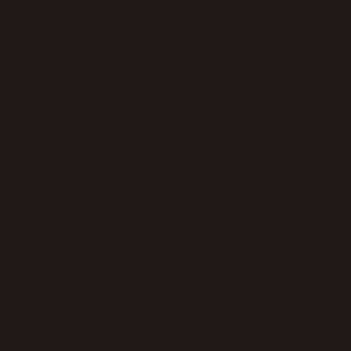
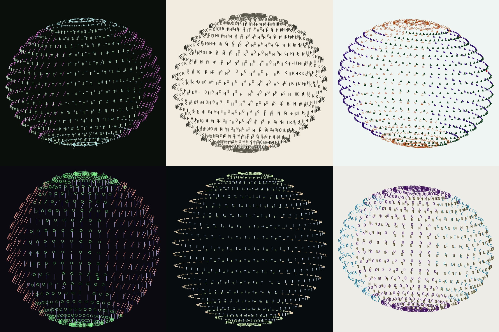
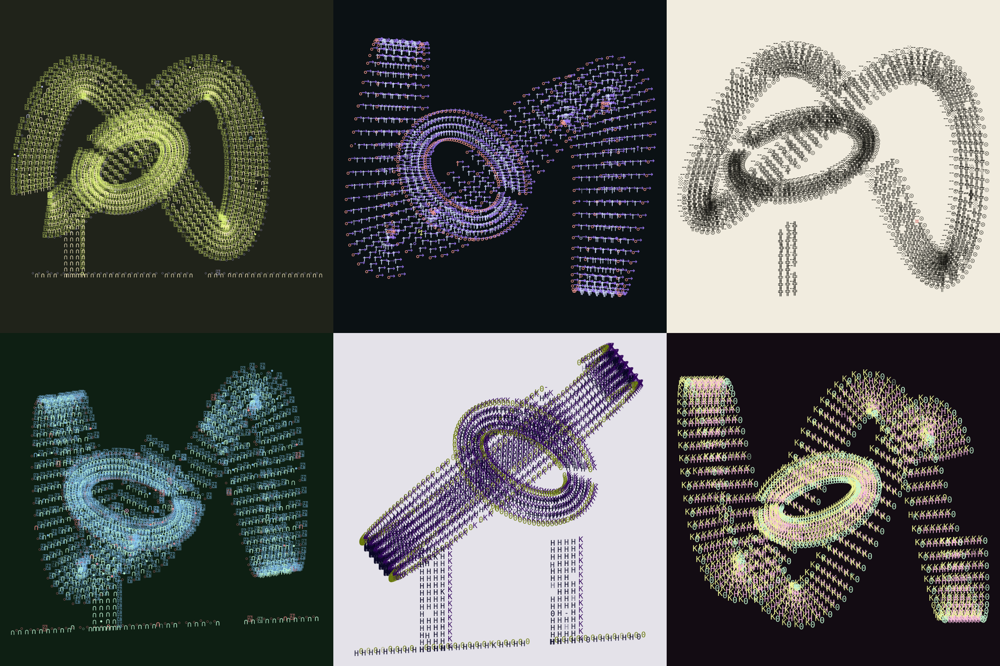
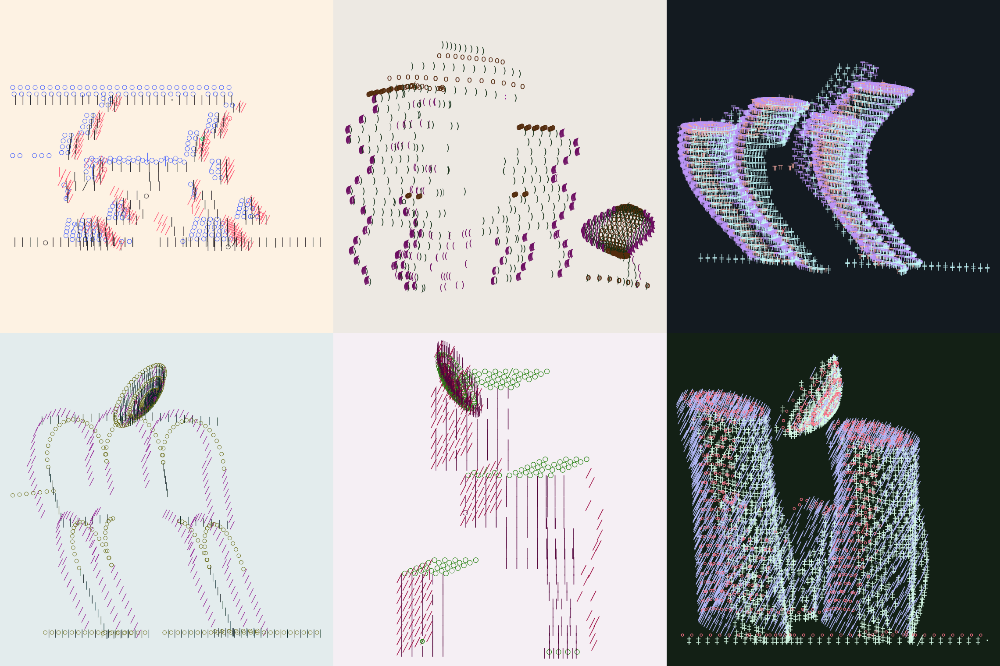
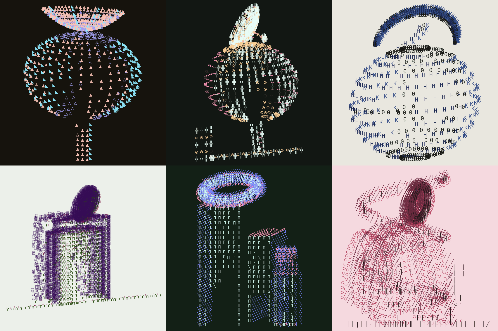
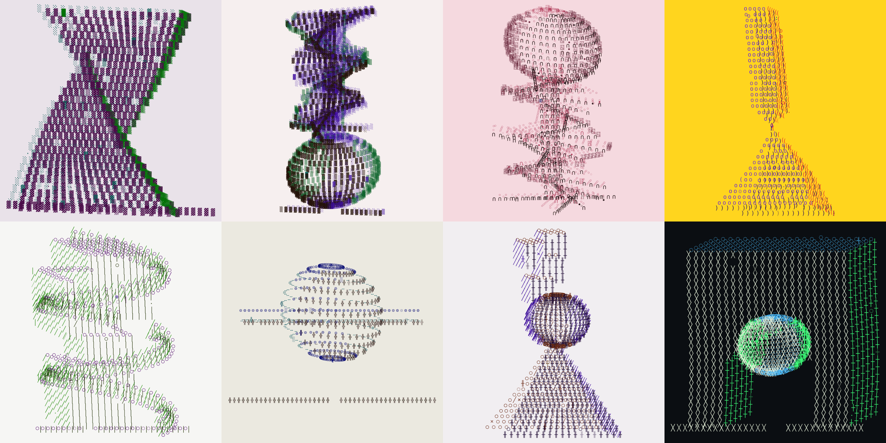

# ESPACIO ESCULTÓRICO — edición Verse

Adaptación de [`arquitecturasunicode`](../) al formato de token generativo de
[**generative-verse**](https://docs.verse.works/docs/projects/generative-verse/).
Mismo motor (`rng` + `corpus` + `architecture`), otra piel.



[Vista fija de esfera monumental](preview.png)

## v0.14 — caracteres de paisaje, onda estacionaria y loops mezclados

Entran cuatro fuentes de la carpeta `paisaje` —**ELECTRONICS**, **jeroglíficos
egipcios**, **jeroglíficos anatolios** y **Lineal B**— pero no como una paleta
más: llegan por dos caminos deliberadamente escasos.

- **Intrusión** (≈30% de las semillas): un puñado de signos que no pertenecen a
  la paleta se cuelan en la pieza. Unas veces es un jeroglífico o un símbolo
  electrónico —con su propia fuente—; otras, un *block element* pintado con un
  **color que no existe en la página** (el matiz más lejano a toda la paleta).
  Es puntual, no una lluvia: nunca más de cinco signos.
- **Grafía exótica** (≈4% de las semillas): muy rara vez, una cara entera de la
  pieza deja de ser tipográfica y se vuelve jeroglífica o electrónica. Justo
  porque casi no se selecciona, cuando aparece es exclusiva.

Nace una figura escultórica nueva: **ONDA ESTACIONARIA**. Una membrana grande
que vibra en un modo propio (patrón de Chladni): crestas y valles fijos, líneas
nodales planas. No vive plana ni clavada al suelo: **cabecea y gira** libremente,
y los mástiles son una posibilidad —no una obligación—, así que la mayoría de
las veces simplemente flota y ocupa casi todo el cuadro. Los signos se montan
sobre la superficie; frente, lateral y cubierta emergen de la pendiente local,
no de un volumen macizo.

La **ANTENA PARABÓLICA** puede volverse **monumental**: a veces el paraboloide
desborda el ancho del edificio y recibe más anillos para no perder densidad.

Los **loops dejan de vivir sólo en la especie entrelazada**. El toro tejido del
LAZO HABITABLE regresa como ensamblaje escultórico —**LAZO ATRAVESADO**— donde
una esfera lo cruza por el centro. Así los loops se mezclan con esferas, ondas y
cubos, como los círculos y anillos de las demás composiciones.

La **ménsula ya no aparece sola**: cuando su genealogía iba a quedarse sin
cubierta ni anexo, recibe una compañera —a menudo la propia media luna. Y la
**MEDIA LUNA sale de la corona**: un nuevo anexo la coloca de costado, a media
altura, sostenida por su cuerno o flotando. Ahora se la ve en otras posiciones,
no sólo coronando —y ahora aparece con más frecuencia y más grande para que se
la vea de verdad.

## v0.12 — cuerpos autónomos y tres manifiestos

Regresa la esfera grande como una especie propia: **ESFERA MONUMENTAL**. Es un
solo cuerpo cerrado, de detalle alto, sin eje horizontal, pedestal ni línea de
suelo. En la auditoría de 2,000 semillas apareció 69 veces; **ESFERA
ATRAVESADA** y su eje horizontal salen por completo del catálogo actual.



**LAZO HABITABLE** deja de repetir una composición central. La semilla elige
entre seis emplazamientos —centro, ambos laterales, suspendido, diagonal o
expulsado—; tres leyes —órbita, ocho o triple pliegue—; y cuatro apoyos —doble,
izquierdo, derecho o flotante—. Su habitación interior también deriva respecto
del lazo exterior y la línea de suelo se vuelve minoritaria.



La **ANTENA PARABÓLICA** pierde mástil, brazo focal y receptor. Queda únicamente
el paraboloide tipográfico: una superficie inclinada que puede posarse o flotar
sobre la arquitectura.

Comienza además una gramática de lenguajes que modifica realmente los puntos,
no sólo el metadato:

- **EXPRESIONISMO MODERNO**: empuje vertical, curvatura emotiva y ensanchamiento;
- **DECONSTRUCTIVISMO**: el edificio se divide en cuatro a siete bandas
  desplazadas, levantadas y cizalladas de manera independiente;
- **PARAMETRISMO**: dos a cuatro campos continuos ondulan posición, profundidad
  y altura;
- **SIN MANIFIESTO** conserva la geometría directa y evita que estas escuelas
  dominen toda la serie.



## v0.11 — la cubierta deja de ser una conclusión

La parte superior se convierte en una segunda gramática escultórica. Tres
cubiertas nuevas entran en las genealogías:

- **CÚPULA INVERSA**: un cuenco 3D cuyo centro puede tocar el edificio, colgar
  de dos tensores, apoyarse en un mástil lateral o desafiar la gravedad;
- **MEDIA LUNA INVERTIDA**: un arco lunar de espesor variable, sostenido por
  cualquiera de sus cuernos, por un mástil excéntrico o por nada;
- **ANTENA PARABÓLICA**: paraboloide inclinado con profundidad, mástil, brazo
  focal y receptor.



`ANILLO SUPERIOR` ya no implica dos apoyos simétricos. Puede descansar sobre
**dos pilares, un mástil central, un mástil izquierdo, un mástil derecho o un
trípode oblicuo**. La variante queda registrada en la ficha y en los features
de Verse.

`ESFERAS` combina con especial frecuencia estas cuatro cubiertas. Además, su
línea de suelo deja de ser obligatoria: en la auditoría de 2,000 semillas,
aproximadamente **71% de las arquitecturas esféricas quedaron libres de suelo**.
En esa misma muestra aparecieron 114 cúpulas inversas, 81 medias lunas y 105
antenas parabólicas. La antigua CÚPULA INVERSA no desaparece de la familia no
euclidiana; ahora también puede coronar cualquier genealogía.

## v0.10 — toda la pantalla pertenece a la escultura

El colofón deja de ocupar la franja inferior. La arquitectura se reencuadra
ahora dentro de un campo de **924 × 924 px** —antes 844 × 764— y puede crecer
hasta 3.75 veces respecto a sus coordenadas de origen. Las piezas verticales
ganan cerca de **21% de altura útil**.

Título, frase, forma, alfabeto, color, perspectiva, duración y semilla pasan a
una ficha HTML bajo demanda. Se abre con la tecla `i` o con el punto sensible
inferior derecho y se cierra con `Esc`. Tanto `i` como `GIF` son invisibles
mientras se escribe y cuando no tienen foco o cursor.

La ficha no pertenece al SVG. Tampoco aparece en la captura final ni en el GIF:
las tres superficies conservan únicamente papel y signos. Los datos continúan
disponibles para Verse mediante `window.$artifact.features` y para tecnologías
de asistencia mediante el título y la descripción del SVG.

## v0.9 — el edificio se convierte en espacio escultórico

La pieza cambia de nombre y de escala conceptual. **ESPACIO ESCULTÓRICO** ya no
combina solamente plantas, estructuras y cubiertas: ensambla cuerpos autónomos
que pueden apoyarse, atravesarse, orbitar o mantenerse en un equilibrio
improbable.

Una sexta especie ocupa aproximadamente **18%** de las semillas y produce ocho
relaciones:

- **ESFERA SOBRE HÉLICE** y **HÉLICE SOBRE ESFERA**;
- **OBELISCO ROTO**, con una pirámide y un fuste invertido tocándose en la punta;
- **PIRÁMIDES INTERPENETRADAS**;
- **ESFERA ATRAVESADA** por un eje horizontal;
- **CUBOS EN ESPIRAL**;
- **ARCO CON CUERPO SUSPENDIDO**;
- **EQUILIBRIO DE TRES CUERPOS**: pirámide, esfera y cubo.



ESFERA, PIRÁMIDE y OBELISCO ROTO también entran en las arquitecturas de
genealogía y en los edificios que se esperan. La TORRE HELICOIDAL gana peso
generativo. La esfera grande deja de depender únicamente de la rara familia no
euclidiana.

La cubierta puede ser **NINGUNA**. En la auditoría de v0.9 aparece en cerca de
29% de las genealogías; anillo, cúpula y corona juntos quedan por debajo de 36%.
Siguen siendo posibles, pero ya no concluyen automáticamente las formas.

Al final del colofón aparece un vínculo casi invisible: `GIF ↘`. Reconstruye la
coreografía determinista de la semilla, codifica entre 18 y 34 cuadros de
600 × 600 px dentro del navegador y descarga el resultado. No graba la pantalla
ni usa un servidor. El codificador local es
[`gifenc`](https://github.com/mattdesl/gifenc), distribuido bajo licencia MIT.

## Qué cambia respecto a la versión vertical

| | versión vertical (`../`) | edición Verse (esta carpeta) |
|---|---|---|
| **Formato** | lámina 900 × 1200 (retrato) | **cuadrada 1000 × 1000**, a sangre en cualquier viewport |
| **Interfaz** | cabecera, panel, botones, exportaciones, teclas | sólo la obra; `i` y `GIF` aparecen al buscar el borde inferior derecho |
| **Semilla** | `?seed=` en la URL + botón «otra arquitectura» | **hash inyectado por Verse** (`?payload=base64(JSON)`) |
| **Datos de la pieza** | ficha en el panel lateral (HTML) | **ficha HTML bajo demanda, fuera del SVG y del GIF** |
| **Serie / edición** | — | **no se imprime**: la administra Verse (sí va en los `features`) |
| **Rasgos** | `dl` en el DOM | `window.$artifact.features` para el metadato del token |

La computadora sigue decidiéndolo todo: especie, frase, masa, vacío,
perspectiva, temperatura, error, morfología, alfabeto, color, copia carbón y
anomalía. La misma semilla reconstruye exactamente el mismo espacio.

## v0.8 — la computadora escribe el edificio

La arquitectura ya no aparece terminada: se escribe como una coreografía de
signos. No avanza línea por línea. **Frente, profundidad y cubierta** son tres
familias tipográficas con recorridos diferentes y ventanas temporales que se
solapan: el frente tiende a crecer desde el suelo, los laterales cruzan el
volumen en diagonal y las cubiertas recorren curvas y coronas.

El ritmo también pertenece a la semilla. Alterna ráfagas y respiraciones, y la
duración total varía entre aproximadamente **2.4 y 8.2 segundos**; nunca baja de
dos segundos. Entre 2.5% y 14% de los signos pueden cometer una equivocación
transitoria: aparece otro carácter de la paleta, queda un vacío breve como
backspace y finalmente regresa el signo correcto. Estos tropiezos performativos
no sustituyen los errores estructurales permanentes de la pieza.

Un único `requestAnimationFrame` administra todos los eventos, incluso cuando
hay miles de glifos. Verse recibe `verse:ready` y `fxpreview()` solamente después
de la última corrección, para que la miniatura capture el edificio completo.
`?still=1` o la preferencia `prefers-reduced-motion` muestran inmediatamente el
estado final.

## v0.7 — genealogías de color y pisos que giran

El color dejó de depender solamente de un catálogo cerrado. En aproximadamente
**72%** de las semillas, tres valores HSL originan una genealogía cromática
determinista inspirada en el sistema de [`canekzapata/fonts`](https://github.com/canekzapata/fonts):
los colores hijos derivan recursivamente de un matiz padre y pueden saltar 120°,
180° o permanecer incómodamente cerca. El 28% restante conserva las paletas
editadas de versiones anteriores.

Hay seis leyes: **RECURSIVA, COMPLEMENTARIA BRUSCA, TERMINAL ÁCIDA, TRÍADA
ELÉCTRICA, ARCHIVO MUTANTE** y **ANÁLOGA TENSIONADA**. Frente y fondo mantienen
contraste fuerte; laterales y cubiertas tienen un umbral propio para que el
volumen siga siendo legible. Esto permite miles de combinaciones, incluidos
los encuentros violentos de neón sobre fondos casi negros y tinta oscura con
caras súbitamente eléctricas sobre papel.

Dos nuevas estructuras amplían el vocabulario 3D:

- **TORRE HELICOIDAL**: entre 16 y 27 losas habitables giran alrededor de un
  núcleo; la cintura se contrae y expande mientras asciende.
- **CUBOS ENCAJADOS**: masas voxeladas de proporción cúbica se apilan e
  interpenetran, dejando visibles frente, profundidad y cubierta.

Las **ZIGURATS no fueron eliminadas**: siguen existiendo en las dos especies
arquitectónicas y recuperan peso generativo junto con las espirales.

## v0.6 — el arco entra en la gramática

La pieza ahora privilegia la arquitectura volumétrica: aproximadamente **78%**
de las semillas construyen una genealogía de planta + estructura + vacío +
cubierta + anexo + deformación. La vista casi frontal sigue siendo posible,
pero rara (cerca de 2.5%).

El arco ya no pertenece solamente a la especie voxelar aislada. **MASA
ARQUEADA** excava un vano dentro de un cuerpo con frente, profundidad y techo;
puede combinarse con cualquier planta, deformación y anexo. **ANILLO SUPERIOR**
es una cubierta vertical gruesa con dos apoyos que llegan físicamente a la
estructura. Cuando ambos genes coinciden aparece, por fin, el arco con anillo
arriba como motivo recurrente.

También se incorporan **ROTONDA**, **CRUJÍAS PARALELAS** y **PUENTE HABITADO**.
Las familias más planas permanecen como accidentes poco frecuentes; arcadas,
bóvedas, ménsulas, masas arqueadas y rotondas llevan la mayor parte del peso.

## Cómo Verse entrega la semilla

Verse abre `index.html` dentro de un iframe con un `payload` en base64:

```js
const q = new URLSearchParams(location.search).get("payload");
const p = JSON.parse(q ? atob(q) : "{}");
const hash = p.hash;              // semilla determinista
const editionNumber = p.editionNumber;
```

`verse.js` lee ese hash, construye la pieza y la dibuja. Si no hay `payload`
(desarrollo local) genera un hash aleatorio para poder verla. Acepta también
`?hash=`, `?seed=` o `?fxhash=` como alternos.

## Probar en local

```bash
# desde la raíz del repo
python3 -m http.server 8080
```

- Con hash explícito (payload base64 de `{"hash":"loquesea","editionNumber":7}`):
  `http://localhost:8080/lasletras/?payload=eyJoYXNoIjoibG9xdWVzZWEiLCJlZGl0aW9uTnVtYmVyIjo3fQ==`
- Sin payload (hash aleatorio en cada recarga):
  `http://localhost:8080/lasletras/`

Pruebas estadísticas, cromáticas y temporales:

```bash
node lasletras/tests/smoke.js
node lasletras/tests/typewriter.js
node lasletras/tests/gif.js
node lasletras/tests/presentation.js
```

Para el `playground.html` de Verse, apunta el iframe a la URL de `index.html`.

## Rasgos publicados (`window.$artifact.features`)

`Especie`, `Forma`, `Alfabeto`, `Color`, `Sistema cromático`, `Temperatura`,
`Perspectiva`, `Volumen`, `Estructura`, `Vacío`, `Cubierta`, `Lenguaje
arquitectónico`, `Posición del lazo`, `Escritura`, `Copia carbón`, `Intrusión`,
`Grafía exótica` y `Anomalía`. Verse los captura tras ejecutar el código y los
incluye en el metadato de cada edición.

## Reglas de token respetadas

- Sin recursos externos ni llamadas de red: motor y fuentes van en el bundle.
- Determinismo total a partir del hash (`xfnv1a` + `mulberry32`).
- Se adapta a cualquier tamaño de viewport (`viewBox` + `preserveAspectRatio`).
- La escritura comienza tras `document.fonts.ready`, para que no aparezcan
  signos de reserva. Al terminar la última corrección dispara `verse:ready` (y
  `fxpreview()` si existe).

## Formas nuevas (más variedad)

Además del reformateo, el motor ganó vocabulario geométrico y cromático:

- **VÓRTICE** — torre helicoidal que se estrecha al subir, con mástil central;
- **CELOSÍA / CELOSÍAS** — retícula de diagonales cruzadas (morfología de la
  especie *espera* y estructura de la especie *genealogía*);
- **HIPERBOLOIDE** — torre de cintura: dos anillos unidos por generatrices
  rectas que se cruzan y estrechan el talle (superficie reglada, tipo Shújov);
- **ZIGURAT / ZIGURATS** — cuerpo de retranqueos escalonados con terrazas
  (morfología de *espera* y estructura de *genealogía*);
- **ACUEDUCTO / ARCADAS** — arcada repetida de pilares y arcos de medio punto,
  uno o dos niveles (morfología de *espera* y estructura de *genealogía*);
- **VOLADIZOS** — losas en cantiléver apiladas que sobresalen alternando lados
  desde un núcleo central (brutalismo tipo jenga);
- **MÉNSULAS** — bóveda por aproximación de hiladas: cada curso voladiza hacia
  adentro hasta cerrar el vano (corbeling; morfología de *espera* y estructura
  de *genealogía*);
- **TORRE HELICOIDAL** — pisos rectangulares torsionados alrededor de un núcleo;
- **CUBOS ENCAJADOS** — cuerpos cúbicos interpenetrados con tres caras visibles;
- **CÚPULA INVERSA / MEDIA LUNA INVERTIDA / ANTENA PARABÓLICA** — cubiertas
  volumétricas que pueden coronar también esferas, arcos, hélices y obeliscos;
- **ESFERA MONUMENTAL** — esfera autónoma de gran escala, cerrada y sin eje;
- **ONDA ESTACIONARIA** — membrana rectangular que vibra en un modo propio
  (patrón de Chladni), con líneas nodales planas y dos mástiles de apoyo;
- **LAZO ATRAVESADO** — el toro tejido del lazo habitable como ensamblaje
  escultórico, cruzado por una esfera (los loops mezclados con otros cuerpos);
- **LAZO HABITABLE LIBERADO** — seis emplazamientos, tres leyes de curva y
  cuatro condiciones de apoyo;
- 4 alfabetos nuevos: **BLOQUES, TRIÁNGULOS, FLECHAS, REDES**;
- 5 familias cromáticas nuevas: **SEPIA QUEMADO, BAUHAUS, RISO FLÚOR,
  VERDE FÓSFORO, MAGENTA CINTA**.

## Archivos

```text
lasletras/
  index.html         lámina cuadrada + ficha HTML bajo demanda
  js/verse.js        payload → build → reencuadre completo → escritura → features
  js/rng.js          copia del motor (xfnv1a + mulberry32)
  js/corpus.js       copia del motor (frases, alfabetos, color)
  js/architecture.js copia del motor (vóxeles, paramétricas, proyección)
  js/typewriter.js   horario y reproducción por familias de caracteres
  js/gif-export.js   reconstrucción canvas + descarga GIF de cada semilla
  vendor/            gifenc incluido localmente + licencia MIT
  fonts/             Apricot Portable + Symbola + paisaje (Electronics,
                     jeroglíficos egipcio/anatolio y Lineal B), todas en el bundle
  tests/             pruebas estadísticas, temporales, GIF y presentación
```
