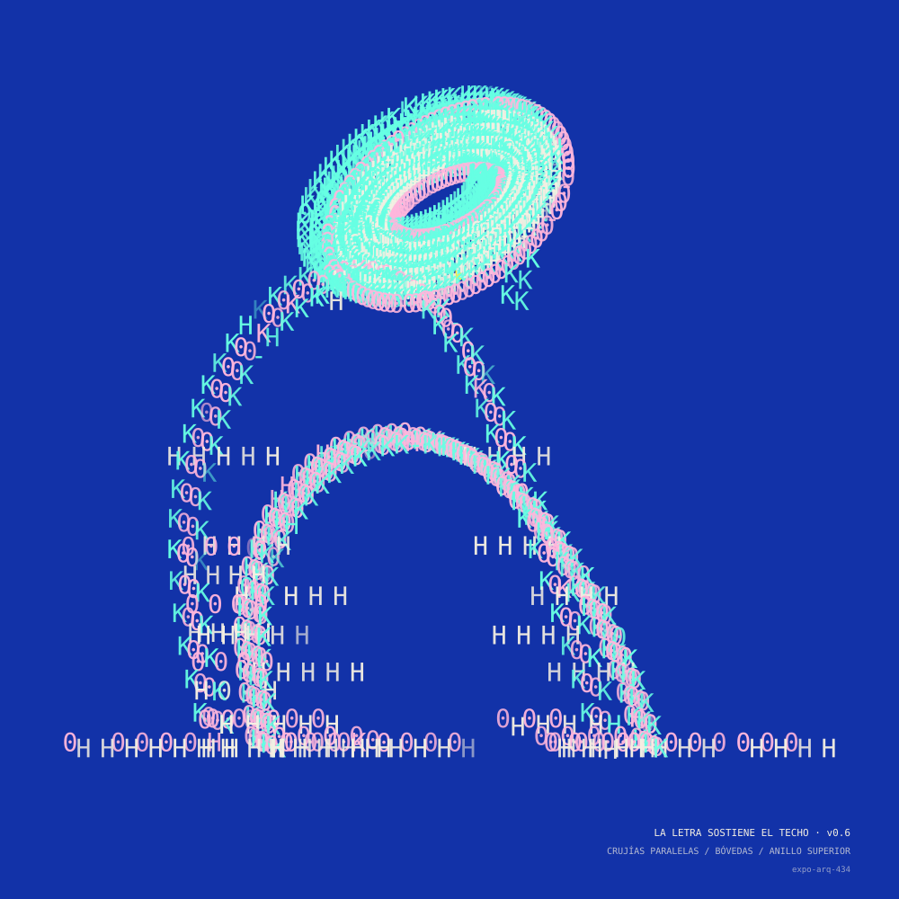

# LA LETRA SOSTIENE EL TECHO — edición Verse

Adaptación de [`arquitecturasunicode`](../) al formato de token generativo de
[**generative-verse**](https://docs.verse.works/docs/projects/generative-verse/).
Mismo motor (`rng` + `corpus` + `architecture`), otra piel.



## Qué cambia respecto a la versión vertical

| | versión vertical (`../`) | edición Verse (esta carpeta) |
|---|---|---|
| **Formato** | lámina 900 × 1200 (retrato) | **cuadrada 1000 × 1000**, a sangre en cualquier viewport |
| **Interfaz** | cabecera, panel, botones, exportaciones, teclas | **ninguna**: sólo la obra |
| **Semilla** | `?seed=` en la URL + botón «otra arquitectura» | **hash inyectado por Verse** (`?payload=base64(JSON)`) |
| **Datos de la pieza** | ficha en el panel lateral (HTML) | **colofón dentro de la imagen, esquina inferior derecha** (SVG) |
| **Serie / edición** | — | **no se imprime**: la administra Verse (sí va en los `features`) |
| **Rasgos** | `dl` en el DOM | `window.$artifact.features` para el metadato del token |

La computadora sigue decidiéndolo todo: especie, frase, masa, vacío,
perspectiva, temperatura, error, morfología, alfabeto, color, copia carbón y
anomalía. La misma semilla reconstruye exactamente la misma arquitectura.

## Cómo Verse entrega la semilla

Verse abre `index.html` dentro de un iframe con un `payload` en base64:

```js
const q = new URLSearchParams(location.search).get("payload");
const p = JSON.parse(q ? atob(q) : "{}");
const hash = p.hash;              // semilla determinista
const editionNumber = p.editionNumber;
```

`verse.js` lee ese hash, construye la pieza y la dibuja. Si no hay `payload`
(desarrollo local) genera un hash aleatorio para poder verla. Acepta también
`?hash=`, `?seed=` o `?fxhash=` como alternos.

## Probar en local

```bash
# desde la raíz del repo
python3 -m http.server 8080
```

- Con hash explícito (payload base64 de `{"hash":"loquesea","editionNumber":7}`):
  `http://localhost:8080/arquitecturasunicode/verse/?payload=eyJoYXNoIjoibG9xdWVzZWEiLCJlZGl0aW9uTnVtYmVyIjo3fQ==`
- Sin payload (hash aleatorio en cada recarga):
  `http://localhost:8080/arquitecturasunicode/verse/`

Para el `playground.html` de Verse, apunta el iframe a la URL de `index.html`.

## Rasgos publicados (`window.$artifact.features`)

`Especie`, `Forma`, `Alfabeto`, `Color`, `Temperatura`, `Perspectiva`,
`Copia carbón` y `Anomalía`. Verse los captura tras ejecutar el código y los
incluye en el metadato de cada edición.

## Reglas de token respetadas

- Sin recursos externos ni llamadas de red: motor y fuentes van en el bundle.
- Determinismo total a partir del hash (`xfnv1a` + `mulberry32`).
- Se adapta a cualquier tamaño de viewport (`viewBox` + `preserveAspectRatio`).
- Render síncrono tras `document.fonts.ready`, para que la captura no salga con
  signos de reserva. Al terminar dispara `verse:ready` (y `fxpreview()` si existe).

## Formas nuevas (más variedad)

Además del reformateo, el motor ganó vocabulario geométrico y cromático
(disponible también para la versión vertical):

- **VÓRTICE** — torre helicoidal que se estrecha al subir, con mástil central;
- **CELOSÍA / CELOSÍAS** — retícula de diagonales cruzadas (morfología de la
  especie *espera* y estructura de la especie *genealogía*);
- **HIPERBOLOIDE** — torre de cintura: dos anillos unidos por generatrices
  rectas que se cruzan y estrechan el talle (superficie reglada, tipo Shújov);
- **ZIGURAT / ZIGURATS** — cuerpo de retranqueos escalonados con terrazas
  (morfología de *espera* y estructura de *genealogía*);
- **ACUEDUCTO / ARCADAS** — arcada repetida de pilares y arcos de medio punto,
  uno o dos niveles (morfología de *espera* y estructura de *genealogía*);
- **VOLADIZOS** — losas en cantiléver apiladas que sobresalen alternando lados
  desde un núcleo central (brutalismo tipo jenga);
- **MÉNSULAS** — bóveda por aproximación de hiladas: cada curso voladiza hacia
  adentro hasta cerrar el vano (corbeling; morfología de *espera* y estructura
  de *genealogía*);
- 4 alfabetos nuevos: **BLOQUES, TRIÁNGULOS, FLECHAS, REDES**;
- 5 familias cromáticas nuevas: **SEPIA QUEMADO, BAUHAUS, RISO FLÚOR,
  VERDE FÓSFORO, MAGENTA CINTA**.

## Archivos

```text
verse/
  index.html         lámina cuadrada, sin infraestructura
  js/verse.js        payload → build → reencuadre cuadrado → ficha → features
  js/rng.js          copia del motor (xfnv1a + mulberry32)
  js/corpus.js       copia del motor (frases, alfabetos, color)
  js/architecture.js copia del motor (vóxeles, paramétricas, proyección)
  fonts/             Apricot Portable + Symbola (van en el bundle)
```
